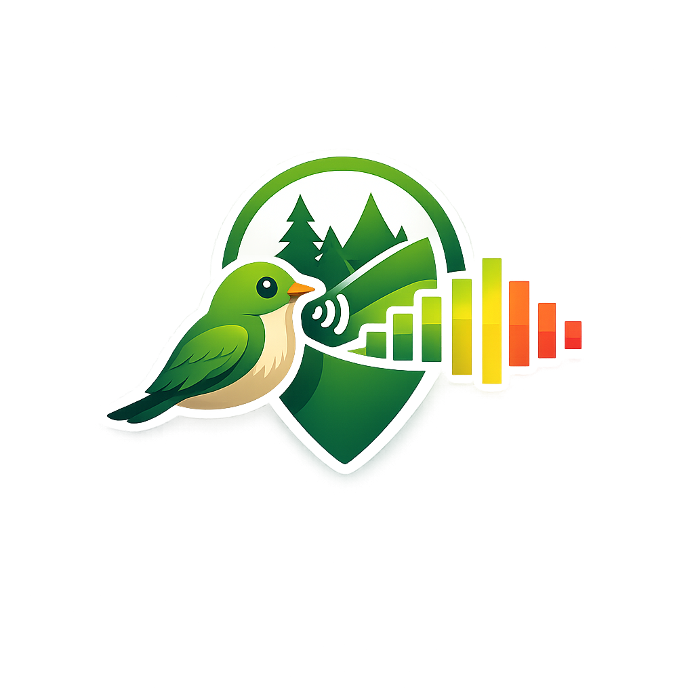
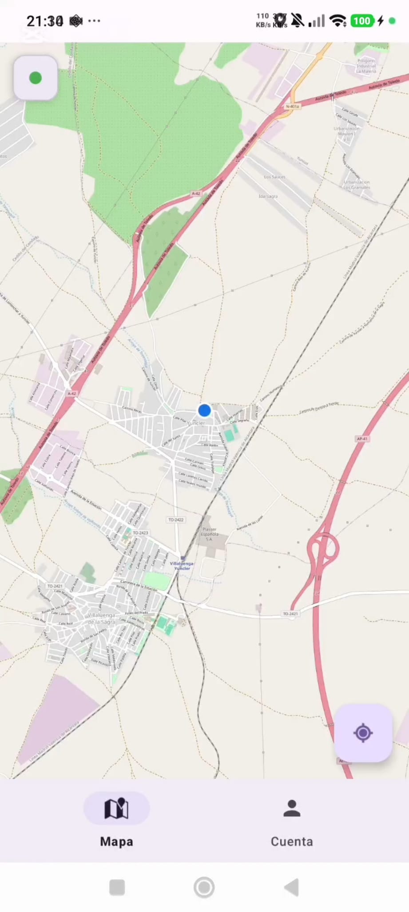
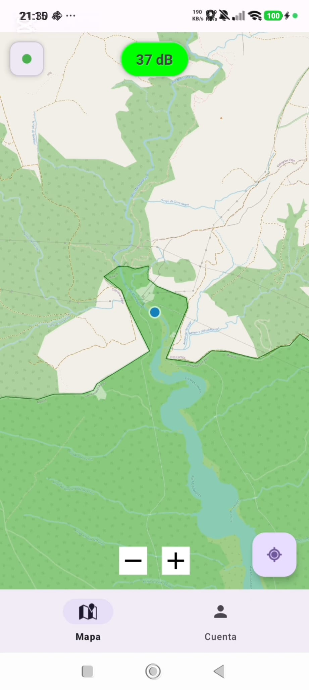
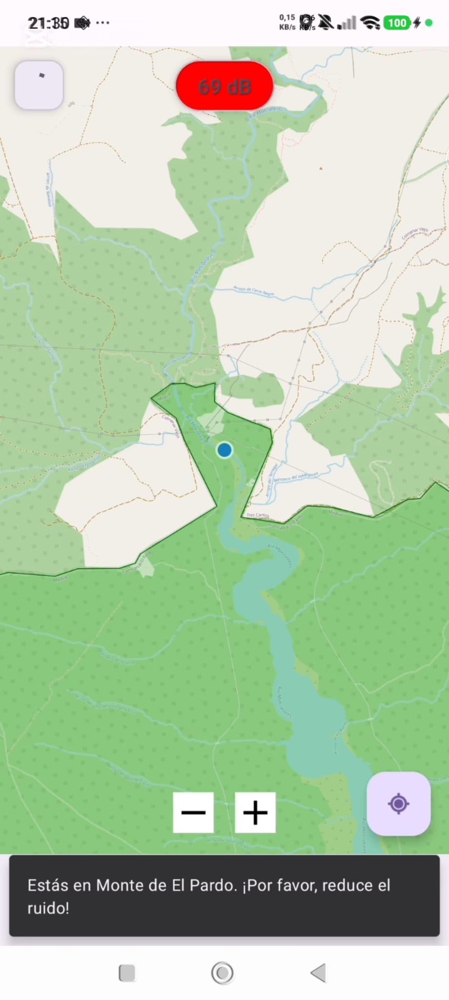
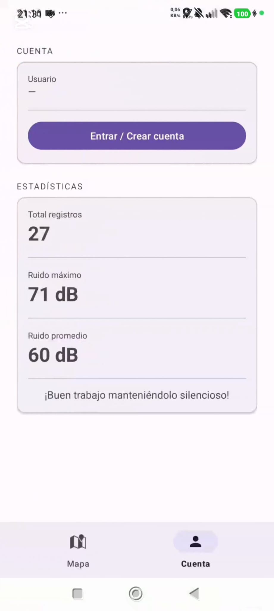
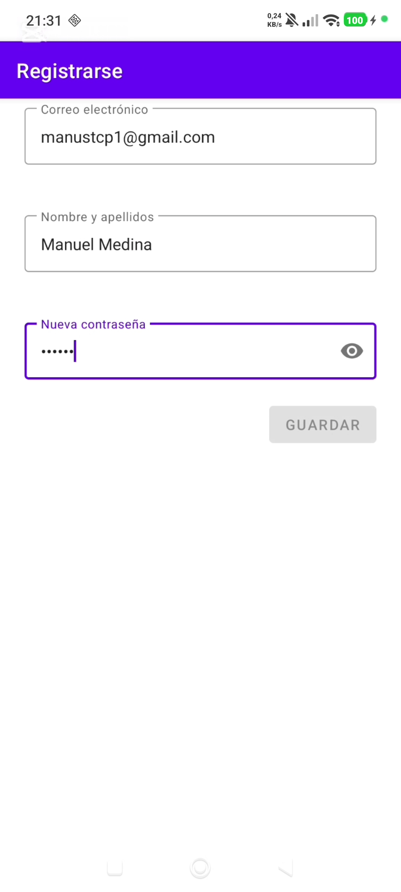
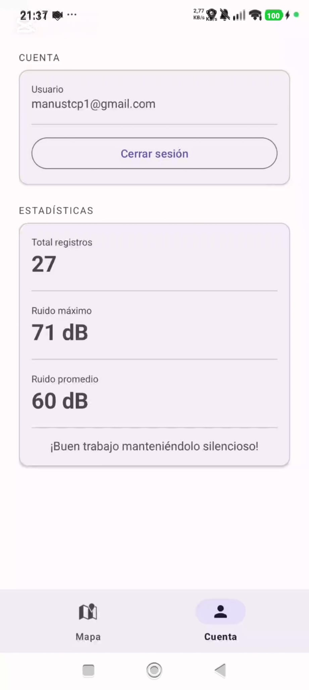
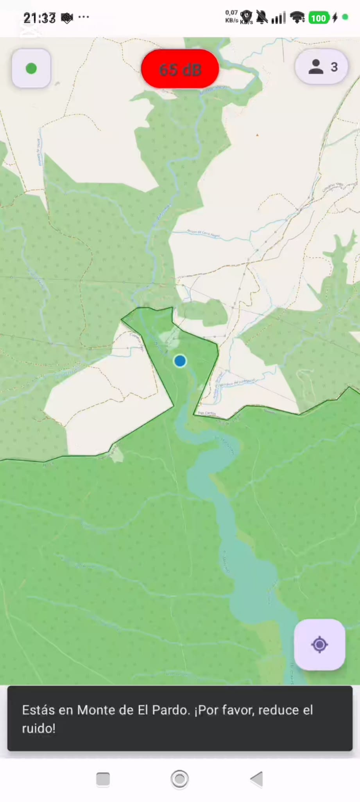
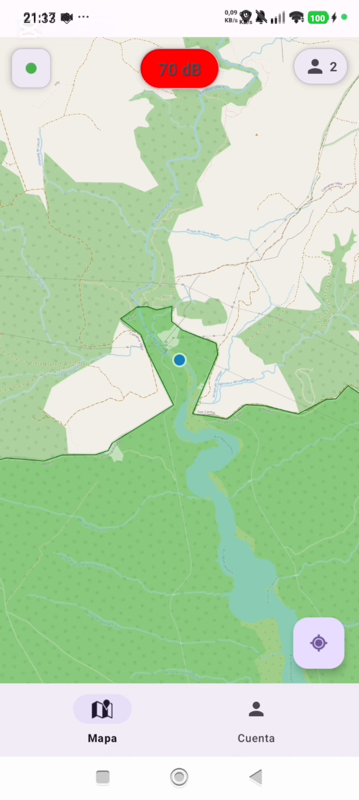

   
   <h1><b>BioQuiet</b></h1>
   
<i>~ Protege la naturaleza, controla tu ruido ~</i>

   

      <a href="https://github.com/StafLoker/bioquiet-backend">Backend</a> ·
      <a href="https://github.com/StafLoker/bioquiet/releases">Releases</a>
   

  

      
   

   
   

   
Aplicación Android para monitorizar el nivel de ruido en Zonas de Especial Protección para las Aves (ZEPA). Avisa al usuario cuando supera los umbrales de ruido permitidos para proteger la fauna local.

   

---

# Features

- **[NUEVO]** Inicio de sesión/Registro con Firebase Authentication (Email y Google).
- **[NUEVO]** Contador en tiempo real de usuarios en la ZEPA actual.
- **[NUEVO]** Arquitectura refactorizada a MVVM.
- Mapa interactivo con las ZEPAs de la zona visible.
- Detección automática de entrada/salida en zonas ZEPA.
- Monitorización del nivel de ruido en tiempo real (dB).
- Alertas visuales (verde / amarillo / rojo) según los umbrales de cada ZEPA.
- Notificación cuando se supera el umbral de advertencia.
- Estadística de ruido generado por usuario (UI Mejorada).

# Como usar

_AVISO: Tener conexión a internet para ver las zonas ZEPA cercanas._

Dar permisos necesarios que pide la aplicación y disfrutar del uso. En caso de que interesen las estadísticas, pasar a 'Statistics'.
Toda funcionalidad principal está en 'Map'.

# Screenshots

<table>
  <tr>
    <td></td>
    <td></td>
    <td></td>
  </tr>
  <tr>
    <td></td>
    <td></td>
    <td></td>
  </tr>
  <tr>
    <td></td>
    <td></td>
  </tr>
</table>

# Demo Video

  <video src="assets/bioquiet_video.mp4" width="600" controls>
    Tu navegador no soporta la reproducción de vídeo. Puedes descargarlo <a href="assets/bioquiet_video.mp4">aquí</a>.
  </video>

---

# Participantes

- _Stefan Oshchypok_ # stefan.oshchypok@alumnos.upm.es
- _Manuel Adrian Mora Medina_ # manuel.mmedina@alumnos.upm.es

Carga de trabajo 50%/50%.